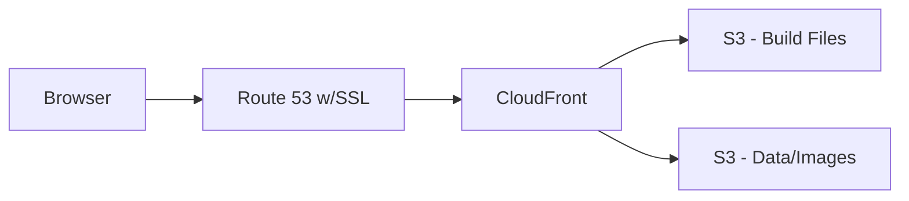

# Golden West Model Horse Show Region 2 Championship Event Website

> Documentation for the Nuxt codebase of [r2champnca.com](https://r2champnca.com).

## About

### Description

`r2champnca.com` is a content-driven website with comprehensive information on the Golden West Model Horse Show Region 2 Championship.

### Features Overview

- Website and images served via AWS CloudFront CDN for high performance and low latency.
- Fully responsive, accessible UI.
- Automated cloud deployment via GitHub Actions CI/CD pipeline.

### Tech Stack

- Language: `TypeScript`
- UI Library: `Nuxt`, `Vue`
- Components & Styling: `NuxtUI (v2)`, `Tailwind CSS`
- Lint & Format: `ESLint`, `Prettier`
- CI: `GitHub Actions`
- Cloud Deploy: `AWS S3`, `AWS CloudFront`, `AWS Route 53`, `AWS Certificate Manager (ACM)`

## Deployment

`r2champnca.com` is a static frontend hosted on S3 from build files generated by Nuxt. Build files and assets, including images event data files, are managed in separate S3 buckets. A CloudFront distribution routes requests between the build and assets buckets as needed. CloudFront automatically caches resources to increase response time and avoid repeat direct requests to S3. `Cache-Control` policies set via CloudFront allow long-lived resources to be cached in the browser to prevent unnecessary requests.

### CI/CD

Continuous integration is managed via a GitHub Actions deployment workflow. Code pushed to the main branch triggers a deployment pipeline that generates static build files, pushes the files to S3, and invalidates the CloudFront cache so that these files will be served on subsequent requests.

### SSL

The site domain `r2champnca.com` is managed by Route 53. SSL certification is configured for the domain with AWS Certificate Manager.

### Request paths



## Additional Information

### Links

- [Visit r2champnca.com](https://r2champnca.com)

### Local Development

> How to run the application locally. Requires Node.

```bash
# After cloning the application:
# Install deps and run
npm install
npm run dev

# Lint & Format
npm run lint
npm run prettier

# Build
npm run build
# or
npm run build-static # static build (no SSR)
```